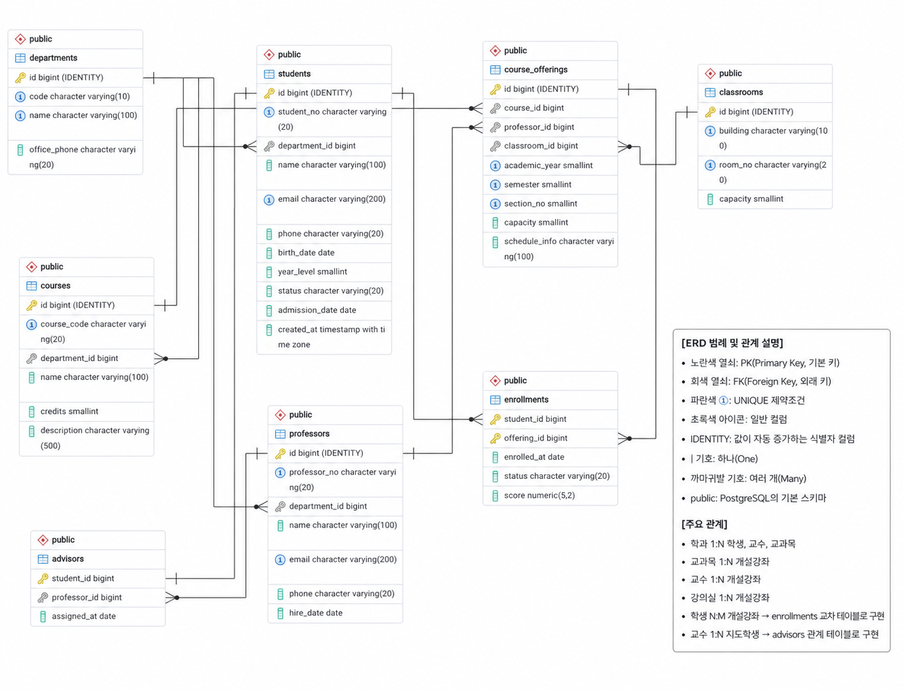
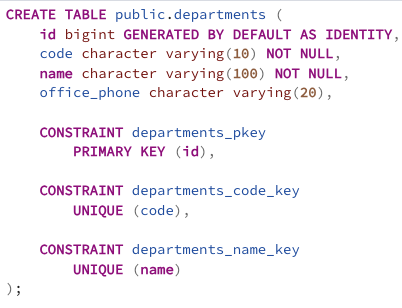
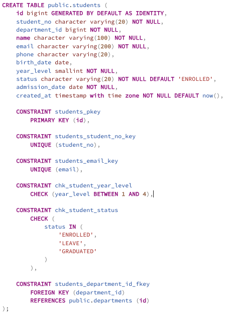
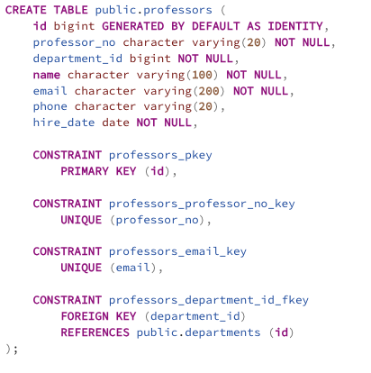
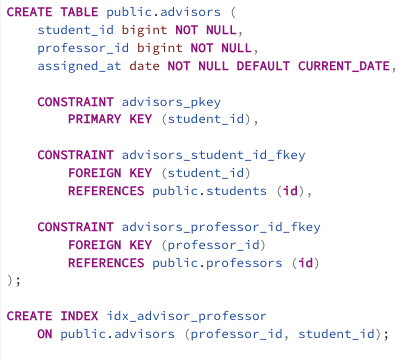
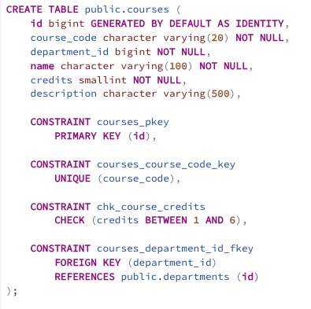
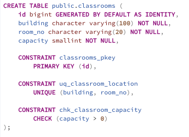
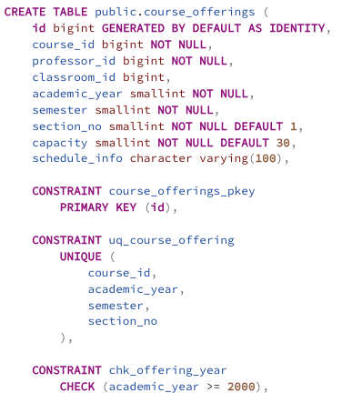
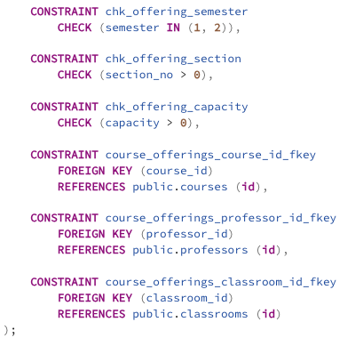
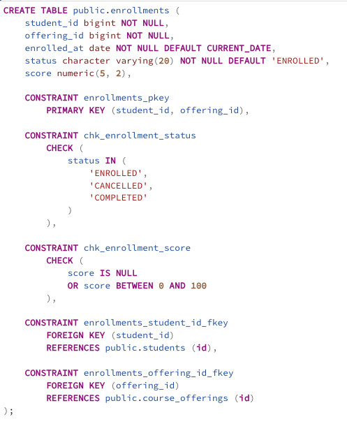

# 학사관리시스템 데이터베이스 설계 및 실습 보고서

## 1. 학사관리시스템 요구사항 및 설계 방향

### 1.1 시스템 개요

본 학사관리시스템은 대학에서 관리하는 학과, 학생, 교수, 교과목, 강의실, 개설강좌, 지도교수 및 수강신청 정보를 통합적으로 관리하는 것을 목적으로 한다. 학생이 특정 학기에 개설된 강좌를 신청하고, 수강 완료 후 성적을 부여받는 기본적인 학사 업무를 데이터베이스로 구현한다.

이번 실습에서는 PostgreSQL을 사용하여 ERD 설계, 테이블 생성, 샘플 데이터 입력 및 다양한 조회 기능을 수행할 수 있도록 시스템 범위를 설정하였다.

### 1.2 주요 요구사항

학사관리시스템에서 관리해야 하는 주요 정보는 다음과 같다.

- 학과의 학과 코드, 학과명 및 사무실 전화번호를 관리한다.
- 학생의 학번, 이름, 소속 학과, 이메일, 학년, 학적 상태 및 입학일을 관리한다.
- 교수의 교수번호, 이름, 소속 학과, 이메일 및 임용일을 관리한다.
- 교과목의 교과목 코드, 교과목명, 운영 학과, 학점 및 설명을 관리한다.
- 강의실의 건물명, 호실 및 수용 인원을 관리한다.
- 교과목이 개설되는 연도, 학기, 분반, 담당 교수, 강의실, 수강 정원 및 강의 시간을 관리한다.
- 학생별 지도교수를 관리하며, 한 명의 교수는 여러 학생을 지도할 수 있다.
- 학생의 수강신청일, 수강 상태 및 점수를 관리한다.
- 수강신청 내역을 통해 학생, 교과목, 담당 교수 및 강의실 정보를 통합 조회할 수 있어야 한다.

### 1.3 엔터티 구성

시스템은 다음 8개의 엔터티로 구성하였다.

1. `departments`: 학과 정보
2. `students`: 학생 정보
3. `professors`: 교수 정보
4. `advisors`: 학생과 지도교수 관계
5. `courses`: 교과목 정보
6. `classrooms`: 강의실 정보
7. `course_offerings`: 학기별 개설강좌 정보
8. `enrollments`: 학생의 수강신청 및 성적 정보

교과목 자체의 정보와 학기별 개설 정보를 구분하기 위해 `courses`와 `course_offerings`를 별도 엔터티로 설계하였다. 이에 따라 하나의 교과목을 여러 학기와 분반으로 개설할 수 있다.

### 1.4 엔터티 간 관계

- 하나의 학과에는 여러 학생이 소속될 수 있다.
- 하나의 학과에는 여러 교수가 소속될 수 있다.
- 하나의 학과에서는 여러 교과목을 운영할 수 있다.
- 한 명의 교수는 여러 학생을 지도할 수 있다.
- 한 학생은 최대 한 명의 지도교수를 가질 수 있다.
- 하나의 교과목은 학기와 분반에 따라 여러 개설강좌를 가질 수 있다.
- 한 명의 교수는 여러 개설강좌를 담당할 수 있다.
- 하나의 강의실에서는 여러 개설강좌가 진행될 수 있다.
- 학생과 개설강좌는 N:M 관계이며, 이를 `enrollments` 교차 테이블로 해소하였다.
- 동일한 학생이 동일한 개설강좌를 중복 신청할 수 없도록 복합 기본키를 적용하였다.

### 1.5 데이터베이스 설계 방향

각 테이블에는 시스템 내부에서 안정적으로 데이터를 식별할 수 있도록 `BIGINT IDENTITY` 방식의 대체키를 기본키로 사용하였다. 학번, 교수번호, 학과 코드 및 교과목 코드와 같이 업무상 중복되면 안 되는 값에는 `UNIQUE` 제약조건을 적용하였다.

필수 데이터에는 `NOT NULL` 제약조건을 설정하고, 학년, 학점, 학기, 수강 정원 및 점수에는 `CHECK` 제약조건을 적용하여 잘못된 값이 입력되지 않도록 설계하였다. 학생의 점수는 수강 완료 전까지 정해지지 않을 수 있으므로 `NULL`을 허용하였다.

학생의 문자 등급은 점수로부터 계산할 수 있는 유도 속성이므로 별도 컬럼으로 저장하지 않았다. 조회 시 `CASE WHEN`을 사용하여 A+, A0, B+ 등의 등급을 계산함으로써 점수와 등급이 서로 일치하지 않는 문제를 방지하였다.

또한 학과명, 교과목명, 교수명과 같은 정보를 수강신청 테이블에 반복해서 저장하지 않고 외래키로 연결하였다. 이를 통해 데이터 중복을 줄이고 정보 변경 시 발생할 수 있는 불일치 문제를 최소화하였다.

### 1.6 활용 방향

설계한 데이터베이스를 이용하여 다음과 같은 조회를 수행할 수 있다.

- 학과별 학생 목록 조회
- 재학생 및 특정 학년 학생 조회
- 학기별 개설강좌 조회
- 교수별 담당 강좌 조회
- 학생별 수강신청 내역 조회
- 미입력 점수를 `COALESCE`로 처리한 조회
- 점수에 따른 문자 등급 계산
- 학생·수강신청·개설강좌·교과목을 연결한 `JOIN` 조회

이와 같은 설계를 통해 기본적인 학사정보 관리뿐만 아니라 이후 성적 분석, 수강 현황 집계 및 학과별 통계 기능으로 확장할 수 있도록 구성하였다.

## 2. PostgreSQL 접속 확인

psql을 이용하여 `academic_management_db` 데이터베이스에 접속한 후 `\conninfo` 명령으로 접속 정보를 확인하였다. 또한 `\dt` 명령을 실행하여 학사관리시스템을 구성하는 8개 테이블이 정상적으로 생성된 것을 확인하였다.

> 접속 결과 스크린샷 삽입 위치: `\conninfo`와 `\dt` 실행 결과

## 3. 학사관리시스템 ERD



### 3.1 ERD 범례

- 노란색 열쇠: PK(Primary Key, 기본 키)
- 회색 열쇠: FK(Foreign Key, 외래 키)
- 파란색 ①: UNIQUE 제약조건
- 초록색 아이콘: 일반 컬럼
- `IDENTITY`: 값이 자동 증가하는 식별자 컬럼
- `|` 기호: 하나(One)
- 까마귀발 기호: 여러 개(Many)
- `public`: PostgreSQL의 기본 스키마

### 3.2 주요 관계

- 학과 1:N 학생, 교수, 교과목
- 교과목 1:N 개설강좌
- 교수 1:N 개설강좌
- 강의실 1:N 개설강좌
- 학생 N:M 개설강좌 → `enrollments` 교차 테이블로 구현
- 교수 1:N 지도학생 → `advisors` 관계 테이블로 구현

## 4. 테이블 생성 DDL

ERD를 기반으로 PostgreSQL 데이터 타입과 PK, FK, UNIQUE, NOT NULL, DEFAULT 및 CHECK 제약조건을 적용하여 테이블을 생성하였다. 테이블별 실제 작성 코드는 캡처 화면으로 제시한다.

### 4.1 departments 테이블 생성



`departments` 테이블은 학과 정보를 관리한다. `id`는 자동으로 증가하는 기본키로 설정하였고, 학과 코드와 학과명의 중복을 방지하기 위해 각각 UNIQUE 제약조건을 적용하였다. 학과 코드와 학과명은 필수 입력값이며, 사무실 전화번호는 입력하지 않을 수 있도록 NULL을 허용하였다.

### 4.2 students 테이블 생성



`students` 테이블은 학생의 기본정보와 학적정보를 관리한다. 학번과 이메일에는 UNIQUE 제약조건을 적용하였으며, 학년은 1~4 범위만 입력할 수 있도록 CHECK 제약조건을 설정하였다. 학적 상태는 재학, 휴학, 졸업으로 제한하고, `department_id`를 통해 소속 학과를 참조하도록 설계하였다.

### 4.3 professors 테이블 생성



`professors` 테이블은 교수번호, 이름, 이메일, 연락처 및 임용일을 관리한다. 교수번호와 이메일의 중복을 방지하도록 UNIQUE 제약조건을 설정하였으며, `department_id`를 외래키로 사용하여 교수의 소속 학과를 연결하였다.

### 4.4 advisors 테이블 생성



`advisors` 테이블은 학생과 지도교수의 관계를 관리한다. `student_id`를 기본키로 사용하여 한 학생이 최대 한 명의 지도교수를 갖도록 제한하였다. 교수 한 명이 담당하는 지도학생을 효율적으로 조회할 수 있도록 `professor_id`, `student_id` 순서의 인덱스를 추가하였다.

### 4.5 courses 테이블 생성



`courses` 테이블은 교과목 코드, 교과목명, 학점 및 설명을 관리한다. 교과목 코드에는 UNIQUE 제약조건을 적용하였으며, 학점은 1~6 범위만 입력하도록 제한하였다. `department_id`를 통해 교과목을 운영하는 학과를 참조한다.

### 4.6 classrooms 테이블 생성



`classrooms` 테이블은 건물명, 호실 및 수용 인원을 관리한다. 같은 건물에서 동일한 호실이 중복되지 않도록 건물명과 호실에 복합 UNIQUE 제약조건을 설정하였다. 수용 인원은 0보다 큰 값만 입력할 수 있다.

### 4.7 course_offerings 테이블 생성





`course_offerings` 테이블은 특정 연도와 학기에 실제로 개설되는 강좌를 관리한다. 교과목, 담당 교수 및 강의실을 각각 외래키로 연결하였다. 동일한 교과목이 같은 연도와 학기, 분반으로 중복 개설되는 것을 방지하기 위해 복합 UNIQUE 제약조건을 설정하였다. 학기는 1학기와 2학기로 제한하고 분반과 정원은 0보다 큰 값만 허용하였다.

### 4.8 enrollments 테이블 생성



`enrollments` 테이블은 학생과 개설강좌의 N:M 관계를 해소하는 교차 테이블이다. `student_id`와 `offering_id`를 복합 기본키로 구성하여 동일한 강좌의 중복 신청을 방지하였다. 수강 상태와 신청일을 관리하며, 점수는 성적 확정 전까지 NULL을 허용하고 입력된 경우 0~100 범위로 제한하였다.

### 4.9 수강신청 조회 인덱스 생성


개설강좌별 수강생을 효율적으로 조회할 수 있도록 `offering_id`, `student_id` 순서의 인덱스를 추가하였다. 복합 기본키는 `student_id`, `offering_id` 순서이므로, 반대 방향의 조회를 위한 별도 인덱스를 구성하였다.

<details>
<summary>전체 DDL 원문(편집 참고용)</summary>

```sql
CREATE SCHEMA IF NOT EXISTS academic
    AUTHORIZATION limhaean;

CREATE TABLE academic.departments (
    id BIGINT GENERATED BY DEFAULT AS IDENTITY,
    code VARCHAR(10) NOT NULL,
    name VARCHAR(100) NOT NULL,
    office_phone VARCHAR(20),
    CONSTRAINT pk_departments PRIMARY KEY (id),
    CONSTRAINT uq_departments_code UNIQUE (code),
    CONSTRAINT uq_departments_name UNIQUE (name)
);

CREATE TABLE academic.students (
    id BIGINT GENERATED BY DEFAULT AS IDENTITY,
    student_no VARCHAR(20) NOT NULL,
    department_id BIGINT NOT NULL,
    name VARCHAR(100) NOT NULL,
    email VARCHAR(200) NOT NULL,
    phone VARCHAR(20),
    birth_date DATE,
    year_level SMALLINT NOT NULL,
    status VARCHAR(20) NOT NULL DEFAULT 'ENROLLED',
    admission_date DATE NOT NULL,
    created_at TIMESTAMPTZ NOT NULL DEFAULT CURRENT_TIMESTAMP,
    CONSTRAINT pk_students PRIMARY KEY (id),
    CONSTRAINT uq_students_student_no UNIQUE (student_no),
    CONSTRAINT uq_students_email UNIQUE (email),
    CONSTRAINT fk_students_department
        FOREIGN KEY (department_id) REFERENCES academic.departments (id),
    CONSTRAINT chk_students_year_level CHECK (year_level BETWEEN 1 AND 4),
    CONSTRAINT chk_students_status
        CHECK (status IN ('ENROLLED', 'LEAVE', 'GRADUATED'))
);

CREATE TABLE academic.professors (
    id BIGINT GENERATED BY DEFAULT AS IDENTITY,
    professor_no VARCHAR(20) NOT NULL,
    department_id BIGINT NOT NULL,
    name VARCHAR(100) NOT NULL,
    email VARCHAR(200) NOT NULL,
    phone VARCHAR(20),
    hire_date DATE NOT NULL,
    CONSTRAINT pk_professors PRIMARY KEY (id),
    CONSTRAINT uq_professors_professor_no UNIQUE (professor_no),
    CONSTRAINT uq_professors_email UNIQUE (email),
    CONSTRAINT fk_professors_department
        FOREIGN KEY (department_id) REFERENCES academic.departments (id)
);

CREATE TABLE academic.advisors (
    student_id BIGINT NOT NULL,
    professor_id BIGINT NOT NULL,
    assigned_at DATE NOT NULL DEFAULT CURRENT_DATE,
    CONSTRAINT pk_advisors PRIMARY KEY (student_id),
    CONSTRAINT fk_advisors_student
        FOREIGN KEY (student_id) REFERENCES academic.students (id),
    CONSTRAINT fk_advisors_professor
        FOREIGN KEY (professor_id) REFERENCES academic.professors (id)
);

CREATE INDEX idx_advisors_professor
    ON academic.advisors (professor_id, student_id);

CREATE TABLE academic.courses (
    id BIGINT GENERATED BY DEFAULT AS IDENTITY,
    course_code VARCHAR(20) NOT NULL,
    department_id BIGINT NOT NULL,
    name VARCHAR(100) NOT NULL,
    credits SMALLINT NOT NULL,
    description VARCHAR(500),
    CONSTRAINT pk_courses PRIMARY KEY (id),
    CONSTRAINT uq_courses_course_code UNIQUE (course_code),
    CONSTRAINT fk_courses_department
        FOREIGN KEY (department_id) REFERENCES academic.departments (id),
    CONSTRAINT chk_courses_credits CHECK (credits BETWEEN 1 AND 6)
);

CREATE TABLE academic.classrooms (
    id BIGINT GENERATED BY DEFAULT AS IDENTITY,
    building VARCHAR(100) NOT NULL,
    room_no VARCHAR(20) NOT NULL,
    capacity SMALLINT NOT NULL,
    CONSTRAINT pk_classrooms PRIMARY KEY (id),
    CONSTRAINT uq_classrooms_location UNIQUE (building, room_no),
    CONSTRAINT chk_classrooms_capacity CHECK (capacity > 0)
);

CREATE TABLE academic.course_offerings (
    id BIGINT GENERATED BY DEFAULT AS IDENTITY,
    course_id BIGINT NOT NULL,
    professor_id BIGINT NOT NULL,
    classroom_id BIGINT,
    academic_year SMALLINT NOT NULL,
    semester SMALLINT NOT NULL,
    section_no SMALLINT NOT NULL DEFAULT 1,
    capacity SMALLINT NOT NULL DEFAULT 30,
    schedule_info VARCHAR(100),
    CONSTRAINT pk_course_offerings PRIMARY KEY (id),
    CONSTRAINT uq_course_offerings
        UNIQUE (course_id, academic_year, semester, section_no),
    CONSTRAINT fk_offerings_course
        FOREIGN KEY (course_id) REFERENCES academic.courses (id),
    CONSTRAINT fk_offerings_professor
        FOREIGN KEY (professor_id) REFERENCES academic.professors (id),
    CONSTRAINT fk_offerings_classroom
        FOREIGN KEY (classroom_id) REFERENCES academic.classrooms (id),
    CONSTRAINT chk_offerings_year CHECK (academic_year >= 2000),
    CONSTRAINT chk_offerings_semester CHECK (semester IN (1, 2)),
    CONSTRAINT chk_offerings_section CHECK (section_no > 0),
    CONSTRAINT chk_offerings_capacity CHECK (capacity > 0)
);

CREATE TABLE academic.enrollments (
    student_id BIGINT NOT NULL,
    offering_id BIGINT NOT NULL,
    enrolled_at DATE NOT NULL DEFAULT CURRENT_DATE,
    status VARCHAR(20) NOT NULL DEFAULT 'ENROLLED',
    score NUMERIC(5,2),
    CONSTRAINT pk_enrollments PRIMARY KEY (student_id, offering_id),
    CONSTRAINT fk_enrollments_student
        FOREIGN KEY (student_id) REFERENCES academic.students (id),
    CONSTRAINT fk_enrollments_offering
        FOREIGN KEY (offering_id) REFERENCES academic.course_offerings (id),
    CONSTRAINT chk_enrollments_status
        CHECK (status IN ('ENROLLED', 'CANCELLED', 'COMPLETED')),
    CONSTRAINT chk_enrollments_score
        CHECK (score IS NULL OR score BETWEEN 0 AND 100)
);

CREATE INDEX idx_enrollments_offering
    ON academic.enrollments (offering_id, student_id);
```

</details>

### 4.10 테이블 생성 결과

DDL 실행 후 `\dt` 명령으로 전체 테이블 목록을 확인하고, `\d students`와 `\d enrollments` 명령으로 컬럼 및 제약조건이 정상적으로 생성되었는지 확인하였다.

> 테이블 생성 결과 스크린샷 삽입 위치: `\dt`, `\d students`, `\d enrollments` 실행 결과
