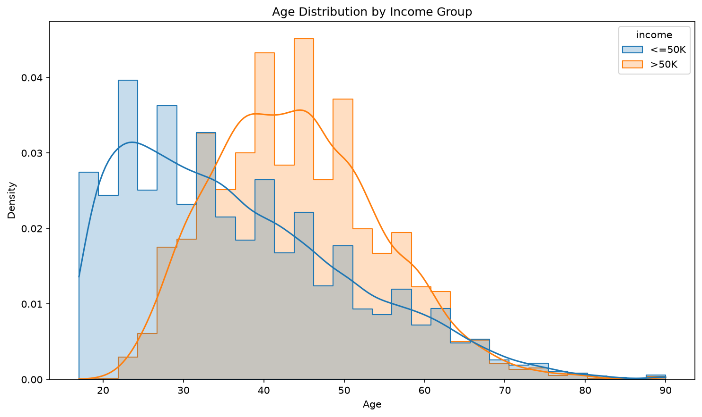
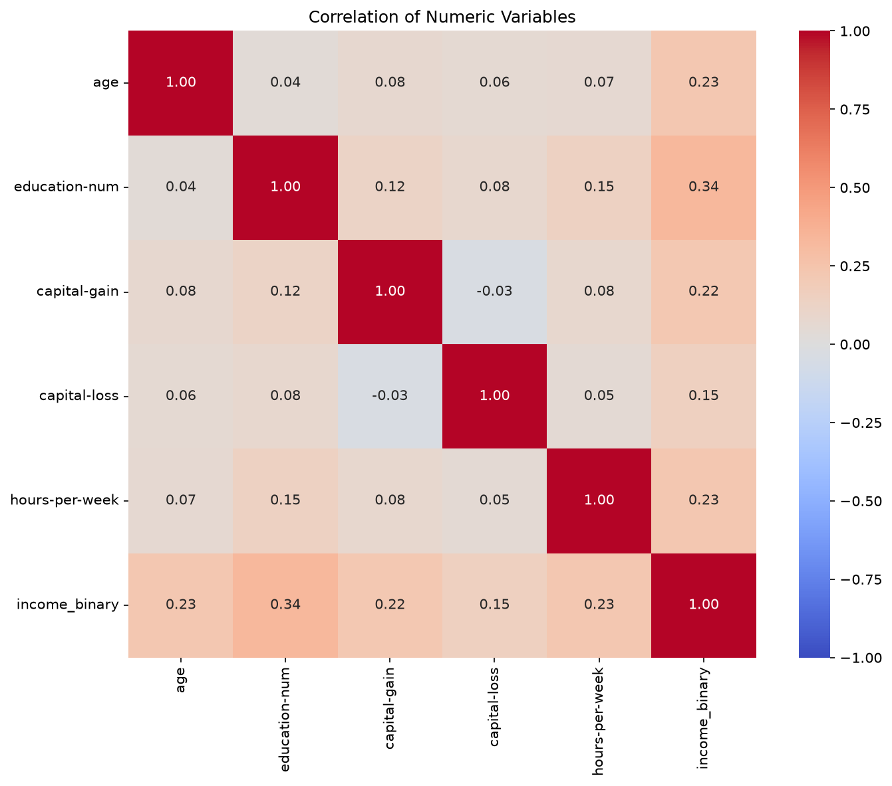
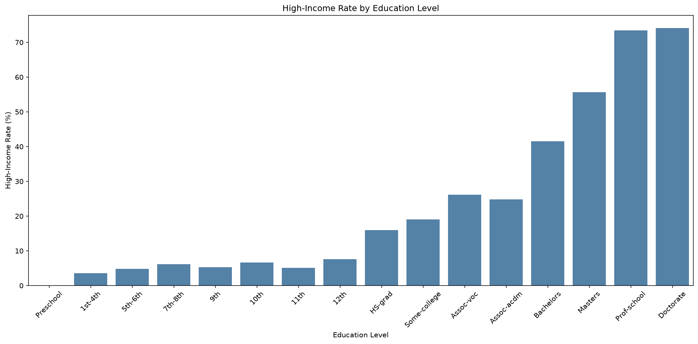

# Adult Census Income End-to-End 분석 보고서

## 1. 분석 목적

개인의 인구통계·교육·근무 특성과 연 소득 50K 초과 여부의 관계를 탐색하고,
전처리와 분류 모델을 결합한 Pipeline으로 고소득 여부를 예측한다.

핵심 질문은 다음과 같다.

1. 소득 그룹에 따라 나이 분포가 다른가?
2. 어떤 수치형 변수가 고소득 여부와 높은 상관관계를 가지는가?
3. 교육 수준에 따라 고소득자 비율이 다른가?

## 2. 데이터 준비

- 원본 데이터: 32,561행 × 15열
- 원본 결측치: 4,262개
- 중복 제거: 24행
- 정제 데이터: 32,537행 × 15열
- Pandas 로딩 시간: 0.025882초
- Polars 로딩 시간: 0.035310초
- 이번 실행에서는 Pandas가 약 1.36배 빠르게 로딩했다.

결측 범주형 값은 `Unknown`으로 대체하고 중복 행은 제거했다.

## 3. 시각화

### 3.1 소득 그룹별 나이 분포



[Plotly 인터랙티브 나이 분포](outputs/age_distribution_plotly.html)

이 그래프는 두 소득 그룹에서 나이가 어떻게 분포하는지 비교한다. Seaborn 차트의
히스토그램은 구간별 밀도를, KDE 곡선은 전체적인 분포 형태를 보여준다. Plotly
차트에서는 막대에 마우스를 올려 구간별 값을 확인할 수 있고, 상단 박스플롯으로
중앙값과 사분위 범위를 함께 탐색할 수 있다.

`<=50K` 그룹의 평균 나이는 36.79세이고 `>50K` 그룹은
44.25세다. 고소득 그룹이 상대적으로 높은 연령대에 집중되어
있지만, 두 분포가 겹치므로 나이만으로 소득 그룹을 구분할 수는 없다.

### 3.2 수치형 변수 상관관계



[Plotly 인터랙티브 상관관계](outputs/correlation_plotly.html)

히트맵은 두 변수의 선형 관계를 -1부터 1 사이의 Pearson 상관계수로 표현한다.
0에 가까울수록 선형 관계가 약하며, 절댓값이 커질수록 관계가 강하다. Seaborn은
전체 행렬을 한눈에 비교하기 좋고, Plotly는 각 셀의 정확한 값을 hover로 확인하기
좋다.

고소득 여부와 절대 상관계수가 가장 큰 변수는 `education-num`이며
계수는 0.335이다. 모든 계수가 강한 수준은 아니므로
단일 변수보다 여러 특성을 함께 사용하는 모델이 적절하다. 또한 상관관계는
인과관계를 의미하지 않는다.

### 3.3 교육 수준별 고소득자 비율



[Plotly 인터랙티브 그룹 비교](outputs/education_income_plotly.html)

막대 높이는 교육 그룹의 전체 인원이 아니라 각 그룹 내 `>50K` 비율을 뜻한다.
교육 수준은 `education-num` 순서로 정렬했다. Seaborn 차트는 그룹 간 비율 변화를
빠르게 비교하기 좋고, Plotly 차트는 hover를 통해 전체 인원과 고소득자 수를 함께
확인할 수 있다.

가장 높은 고소득자 비율은 `Doctorate`의
74.09%이며, 표본은
413명이다. 전반적으로 교육 수준이
높을수록 고소득자 비율이 증가하지만, 그룹별 표본 수 차이와 다른 영향 변수를
고려해야 하며 교육 수준만으로 인과적인 결론을 내려서는 안 된다.

## 4. 통계 분석

### 4.1 주요 수치형 변수의 기술통계

나이, 표본 가중치, 교육 연수, 자본손익, 주당 근무시간의 평균으로 중심적인
수준을 확인하고, 표준편차로 값의 변동성을 비교한다. 25%·50%·75% 분위수는
극단값의 영향을 덜 받으면서 각 변수의 분포 위치와 비대칭성을 파악하기 위해
사용한다.

```text
                     mean        std       25%       50%       75%
age                 38.59      13.64      28.0      37.0      48.0
fnlwgt          189780.85  105556.47  117827.0  178356.0  236993.0
education-num       10.08       2.57       9.0      10.0      12.0
capital-gain      1078.44    7387.96       0.0       0.0       0.0
capital-loss        87.37     403.10       0.0       0.0       0.0
hours-per-week      40.44      12.35      40.0      40.0      45.0
```

### 4.2 수치형 특성과 고소득 여부의 Pearson 상관계수

각 수치형 특성과 `income_binary` 사이의 선형 관계 방향과 강도를 비교해 고소득
여부와 상대적으로 관련성이 큰 변수를 탐색한다. 상관계수는 -1에서 1 사이이며,
절댓값이 클수록 선형 관계가 강하지만 인과관계를 의미하지는 않는다.

```text
                  age  education-num  capital-gain  capital-loss  hours-per-week  income_binary
age             1.000          0.036         0.078         0.058           0.069          0.234
education-num   0.036          1.000         0.123         0.080           0.148          0.335
capital-gain    0.078          0.123         1.000        -0.032           0.078          0.223
capital-loss    0.058          0.080        -0.032         1.000           0.054          0.151
hours-per-week  0.069          0.148         0.078         0.054           1.000          0.230
income_binary   0.234          0.335         0.223         0.151           0.230          1.000
```

고소득 여부와 절대 상관계수가 가장 큰 변수는 `education-num`이며,
상관계수는 0.335이다.

### 4.3 Welch 독립표본 t-test

- `<=50K` 평균 주당 근무시간: 38.84시간
- `>50K` 평균 주당 근무시간: 45.47시간
- t통계량: -45.095026
- p-value: < 1e-300
- 해석: 두 소득 그룹의 평균 주당 근무시간 차이는 통계적으로 유의미하다.

## 5. ML Pipeline

- 수치형 전처리: 중앙값 대체 + 표준화
- 범주형 전처리: 최빈값 대체 + 원핫 인코딩
- 모델: 클래스 가중치를 적용한 Logistic Regression
- Accuracy: 0.8125
- F1 score: 0.6885
- [저장 모델](outputs/income_classification_pipeline.joblib)

## 6. 결론 및 한계

교육 연수, 나이, 주당 근무시간은 고소득 여부와 양의 관계를 보였다. 특히 교육
수준이 높을수록 고소득자 비율이 증가하는 경향이 나타났다. 다만 상관관계와
t-test 결과는 인과관계를 의미하지 않는다. 또한 이 데이터에는 성별·인종과 같은
민감한 특성이 포함되어 있으므로 모델 결과를 실제 의사결정에 사용할 때 편향을
추가로 검토해야 한다.

이 보고서는 `src/end2end.py` 실행 결과로 자동 생성되었다.
