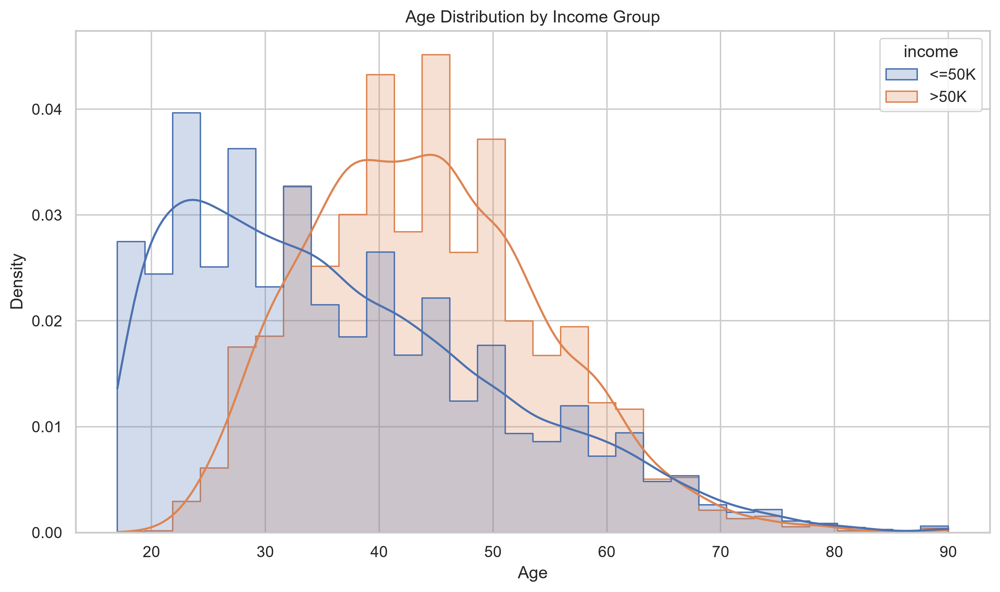
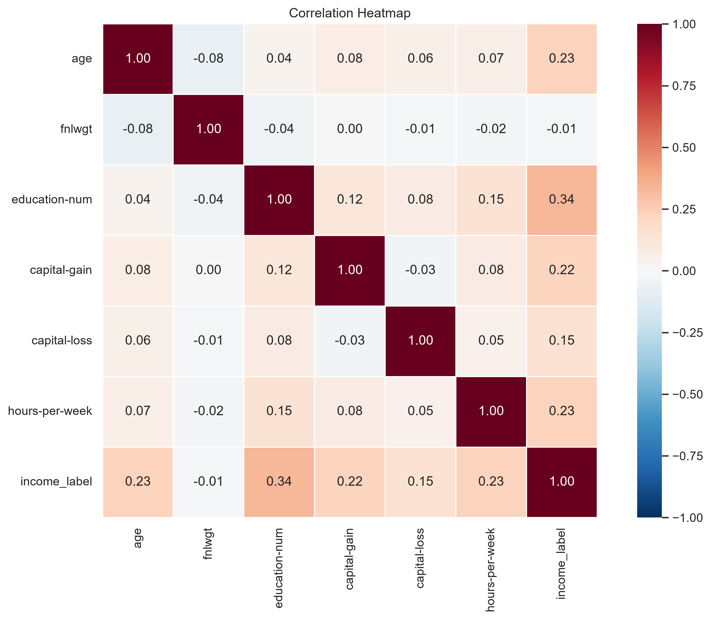
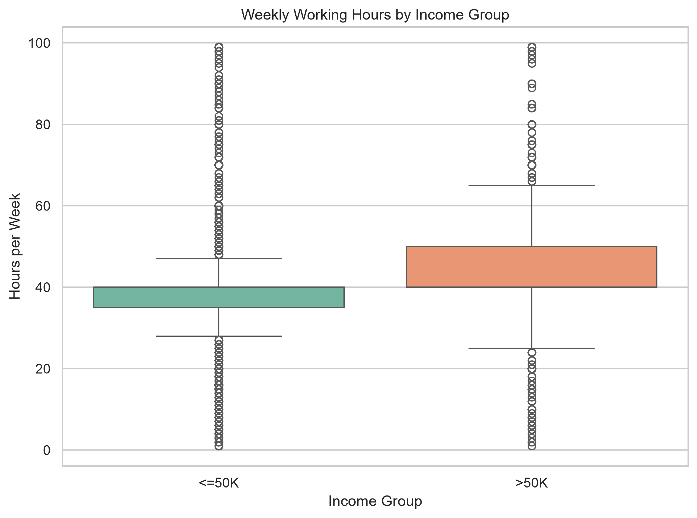

# Adult Census Income 데이터 분석 보고서

## 1. 분석 개요

Adult Census Income 데이터로 개인의 연 소득이 50K를 초과하는지 분류했다.
데이터 품질 처리, EDA, 시각화, 통계 검정과 LogisticRegression Pipeline을
하나의 재현 가능한 실행 흐름으로 구성했다.

- 원본 데이터: `data/adult.data`
- 데이터 SHA-256: `5b00264637dbfec36bdeaab5676b0b309ff9eb788d63554ca0a249491c86603d`
- 원본 크기: 32,561행, 15열
- 정제 후 크기: 32,537행, 16열
- 목표 변수: `income_label` (`<=50K`: 0, `>50K`: 1)

## 2. 데이터 로딩과 품질 처리

### 2.1 Pandas와 Polars 비교

동일한 로컬 파일을 각각 5회 읽고 중앙값을 비교했다.

| 라이브러리 | 데이터 크기 | 로딩 시간(초) | 메모리(MB) |
| --- | --- | --- | --- |
| Pandas | (32561, 15) | 0.0621 | 19.7770 |
| Polars | (32561, 15) | 0.0249 | 3.9485 |

이번 실행에서는 Polars가 Pandas보다 약 2.49배
빠르게 로딩되었고, Pandas의 메모리 사용량은 Polars의 약
5.01배였다. 실행 시간은 환경에 따라 달라진다.

### 2.2 결측치와 중복값

결측 범주는 값을 임의로 추정하지 않고 `Unknown`으로 대체했다.

| 항목 | 결측치 개수 | 결측치 비율(%) |
| --- | --- | --- |
| occupation | 1,843 | 5.6600 |
| workclass | 1,836 | 5.6400 |
| native-country | 583 | 1.7900 |

- 처리 후 결측치: 0개
- 제거한 중복 행: 24개
- 최종 행 수: 32,537개

## 3. 탐색적 데이터 분석

### 3.1 소득 클래스 분포

| income | 개수 | 비율(%) |
| --- | --- | --- |
| <=50K | 24,698 | 75.9100 |
| >50K | 7,839 | 24.0900 |

### 3.2 소득 그룹별 평균

| income | age | education-num | hours-per-week | capital-gain |
| --- | --- | --- | --- | --- |
| <=50K | 36.7900 | 9.6000 | 38.8400 | 148.8800 |
| >50K | 44.2500 | 11.6100 | 45.4700 | 4,007.1600 |

### 3.3 Seaborn 정적 차트

### 3.4 Plotly 인터랙티브 차트

- [소득 그룹별 교육연수 분포](outputs/04_plotly_education_distribution.html)
- [인터랙티브 상관관계 히트맵](outputs/05_plotly_correlation_heatmap.html)
- [직업군별 고소득 비율](outputs/06_plotly_workclass_comparison.html)

직업군 비교에서는 표본 수가 100개 미만인 그룹을 제외했다.

## 4. 통계 분석

### 4.1 기술통계

| 항목 | mean | std | 25% | 50% | 75% |
| --- | --- | --- | --- | --- | --- |
| age | 38.5860 | 13.6380 | 28.0000 | 37.0000 | 48.0000 |
| fnlwgt | 189,780.8490 | 105,556.4710 | 117,827.0000 | 178,356.0000 | 236,993.0000 |
| education-num | 10.0820 | 2.5720 | 9.0000 | 10.0000 | 12.0000 |
| capital-gain | 1,078.4440 | 7,387.9570 | 0.0000 | 0.0000 | 0.0000 |
| capital-loss | 87.3680 | 403.1020 | 0.0000 | 0.0000 | 0.0000 |
| hours-per-week | 40.4400 | 12.3470 | 40.0000 | 40.0000 | 45.0000 |

### 4.2 목표 변수와 수치형 변수의 상관계수

| 항목 | 상관계수 |
| --- | --- |
| education-num | 0.3353 |
| age | 0.2340 |
| hours-per-week | 0.2297 |
| capital-gain | 0.2233 |
| capital-loss | 0.1505 |
| fnlwgt | -0.0095 |

절댓값 기준 가장 큰 상관관계는 `education-num` 변수의
0.3353였다. 상관계수는 인과관계를 증명하지 않는다.

### 4.3 Welch 독립표본 t-test

- 귀무가설: 두 소득 그룹의 평균 주당 근무시간은 같다.
- 대립가설: 두 소득 그룹의 평균 주당 근무시간은 다르다.
- 유의수준: 0.05

| 항목 | 결과 |
| --- | --- |
| 검정 변수 | hours-per-week |
| <=50K 그룹 평균 | 38.8429 |
| >50K 그룹 평균 | 45.4734 |
| 평균 차이 | 6.6305 |
| t 통계량 | 45.0950 |
| p-value | < 1e-300 |
| Cohen's d | 0.5518 |
| 효과크기 | 중간 |

귀무가설을 기각했다. 두 소득 그룹의 평균 주당 근무시간에는 통계적으로 유의한 차이가 있었다. 평균 차이는 6.631시간,
Cohen's d는 0.5518로 효과크기는
중간 수준이다.

## 5. LogisticRegression Pipeline

### 5.1 모델 구성

- 학습 데이터: 26,029행
- 평가 데이터: 6,508행
- 수치형 전처리: 중앙값 대체, StandardScaler
- 범주형 전처리: 최빈값 대체, OneHotEncoder
- 클래스 불균형 처리: `class_weight="balanced"`
- 데이터 분할: 계층화 80:20, `random_state=42`

### 5.2 평가 지표

| 평가 지표 | 값 |
| --- | --- |
| Accuracy | 0.8125 |
| Precision | 0.5741 |
| Recall | 0.8597 |
| F1 | 0.6885 |
| ROC-AUC | 0.9115 |

Recall은 0.8597, Precision은 0.5741였다.
소수 클래스를 적극적으로 찾는 대신 오탐이 늘어나는 균형을 함께 고려해야 한다.

### 5.3 혼동행렬

| 항목 | Predicted <=50K | Predicted >50K |
| --- | --- | --- |
| Actual <=50K | 3,940 | 1,000 |
| Actual >50K | 220 | 1,348 |

### 5.4 분류 리포트

| 항목 | precision | recall | f1-score | support |
| --- | --- | --- | --- | --- |
| <=50K | 0.9471 | 0.7976 | 0.8659 | 4,940.0000 |
| >50K | 0.5741 | 0.8597 | 0.6885 | 1,568.0000 |
| macro avg | 0.7606 | 0.8286 | 0.7772 | 6,508.0000 |
| weighted avg | 0.8572 | 0.8125 | 0.8232 | 6,508.0000 |

### 5.5 주요 모델 계수

계수는 예측 방향을 설명하지만 인과효과가 아니다.

#### 양의 계수 상위 10개

| feature | coefficient |
| --- | --- |
| numeric__capital-gain | 2.2444 |
| categorical__marital-status_Married-civ-spouse | 1.4493 |
| categorical__native-country_Cambodia | 1.2780 |
| categorical__relationship_Wife | 1.1800 |
| categorical__marital-status_Married-AF-spouse | 1.1729 |
| categorical__occupation_Exec-managerial | 0.8678 |
| categorical__occupation_Protective-serv | 0.7750 |
| numeric__education-num | 0.7237 |
| categorical__occupation_Prof-specialty | 0.7064 |
| categorical__occupation_Tech-support | 0.7061 |

#### 음의 계수 상위 10개

| feature | coefficient |
| --- | --- |
| categorical__occupation_Priv-house-serv | -1.7208 |
| categorical__native-country_South | -1.3949 |
| categorical__workclass_Without-pay | -1.1962 |
| categorical__native-country_Columbia | -1.1691 |
| categorical__marital-status_Never-married | -1.1031 |
| categorical__native-country_Dominican-Republic | -1.0652 |
| categorical__relationship_Own-child | -1.0297 |
| categorical__sex_Female | -0.9345 |
| categorical__occupation_Farming-fishing | -0.8958 |
| categorical__marital-status_Separated | -0.8836 |

- 저장 모델: [`models/adult_income_pipeline.joblib`](models/adult_income_pipeline.joblib)
- 모델 메타데이터: [`models/adult_income_pipeline.metadata.json`](models/adult_income_pipeline.metadata.json)
- 저장 후 재로딩 예측 일치: True

## 6. 결론

- 데이터의 약 24%가 `>50K`로 클래스 불균형이 존재했다.
- 수치형 변수 중 `education-num` 변수가 가장 큰 선형 상관관계를 보였다.
- 두 소득 그룹의 주당 평균 근무시간은 통계적으로 유의하게 달랐다.
- LogisticRegression은 Accuracy 0.8125, F1
  0.6885, ROC-AUC 0.9115를 기록했다.
- 저장한 Pipeline과 환경 메타데이터로 재학습 조건을 확인할 수 있다.

## 7. 한계와 개선 방향

- `education`과 `education-num`은 유사한 정보를 중복 표현한다.
- `fnlwgt`는 표본 가중치에 가까워 입력 변수 사용 여부를 검토해야 한다.
- `race`, `sex` 같은 민감 변수는 편향 점검 없이 의사결정에 사용하면 안 된다.
- 단일 학습·평가 분할 대신 교차검증으로 안정성을 확인할 수 있다.
- 분류 임계값 조정으로 Precision과 Recall의 균형을 변경할 수 있다.
- 상관관계, t-test와 모델 계수는 인과관계를 의미하지 않는다.
